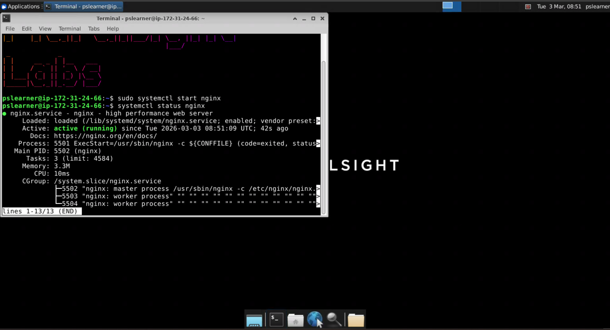
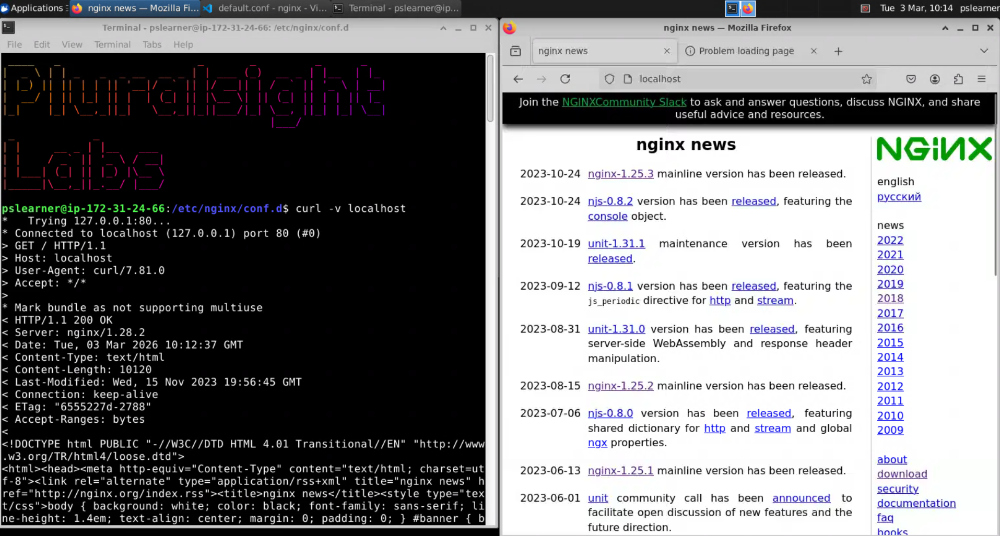
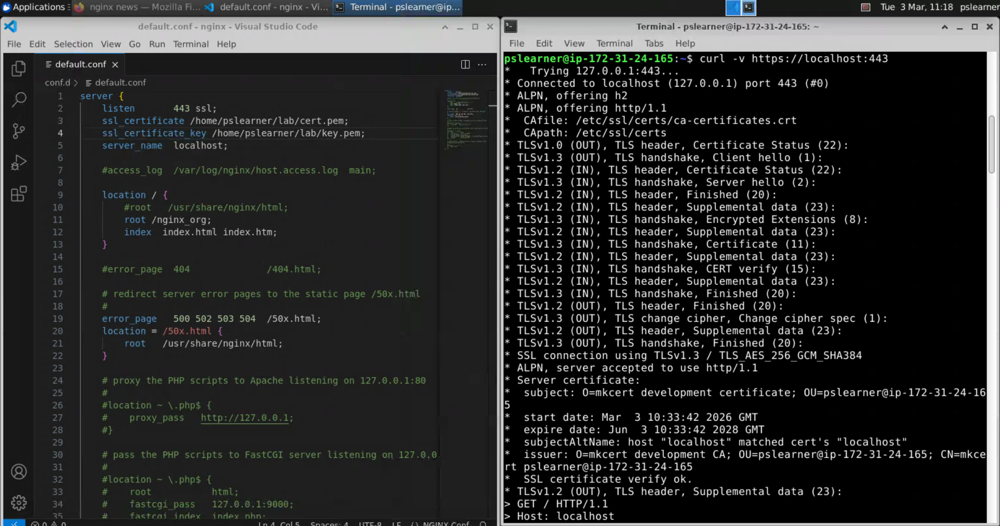
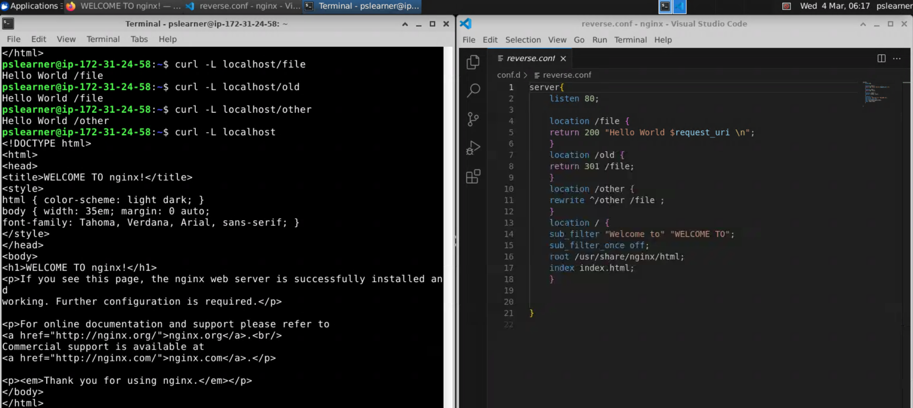

# nginx-lab
Hands-on NGINX infrastructure lab demonstrating static hosting, reverse proxying, TLS termination, and request rewriting.

# NGINX Lab Configs

Configs created during an NGINX hands-on lab.

## What’s included
- Static hosting (`root` + `index`)
- Reverse proxy (`proxy_pass`)
- TLS termination (HTTPS on 443)
- Rewrite/return/sub_filter examples

## NGINX running



## Reverse Proxy Test



## HTTPS Test



##Rewrite, Return, Filter Examples



## Quick tests
```bash
curl -I http://localhost
curl -v http://localhost
curl -v http://localhost:8080
curl -Iv https://localhost
